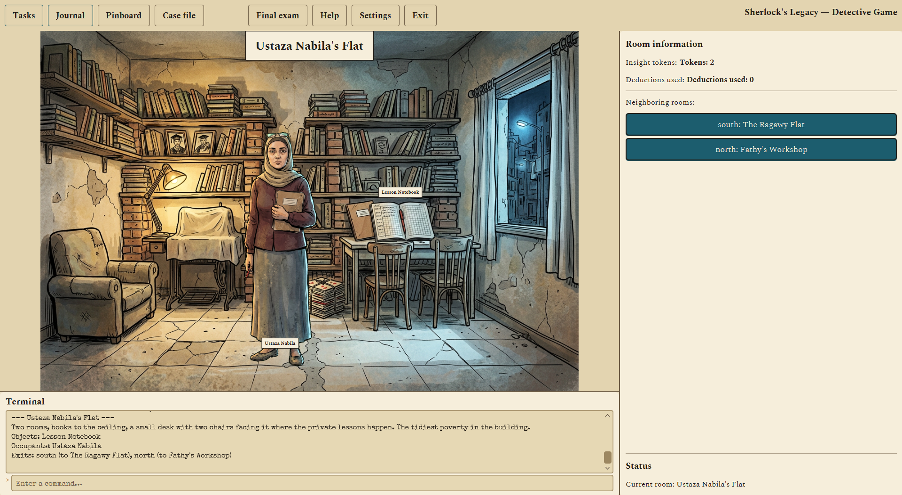
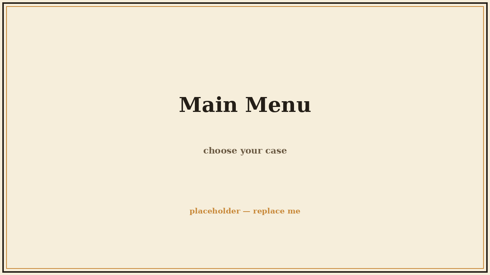
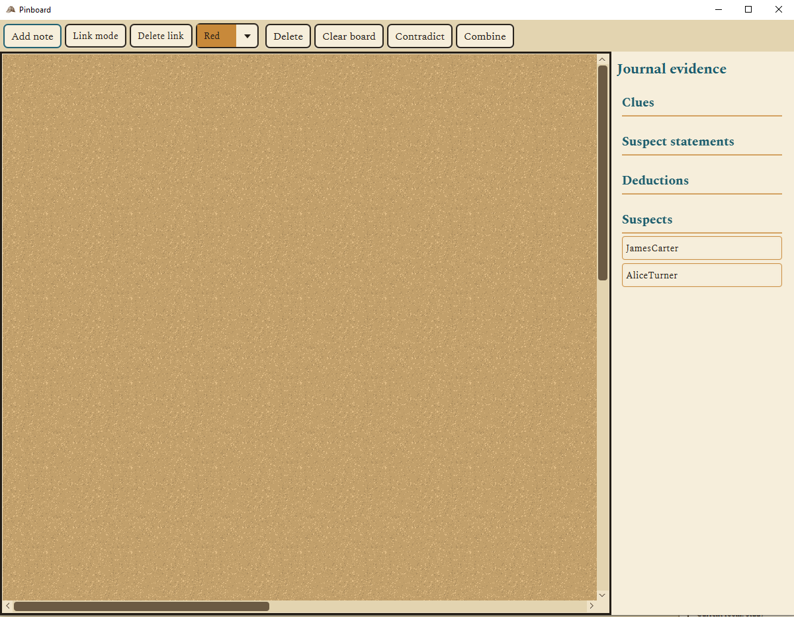
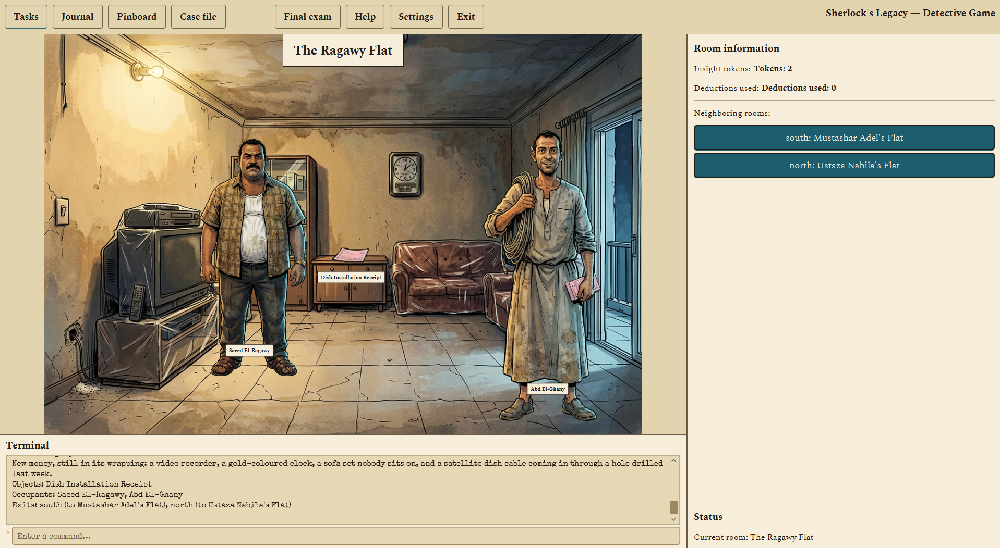
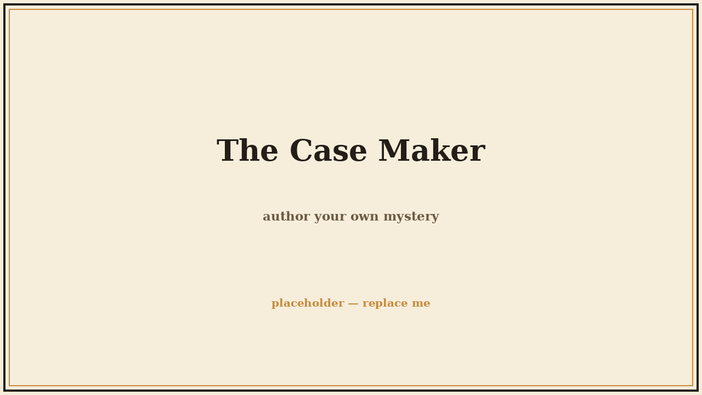
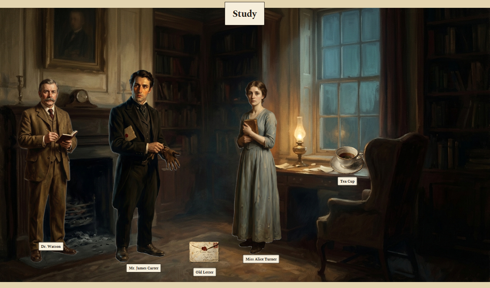
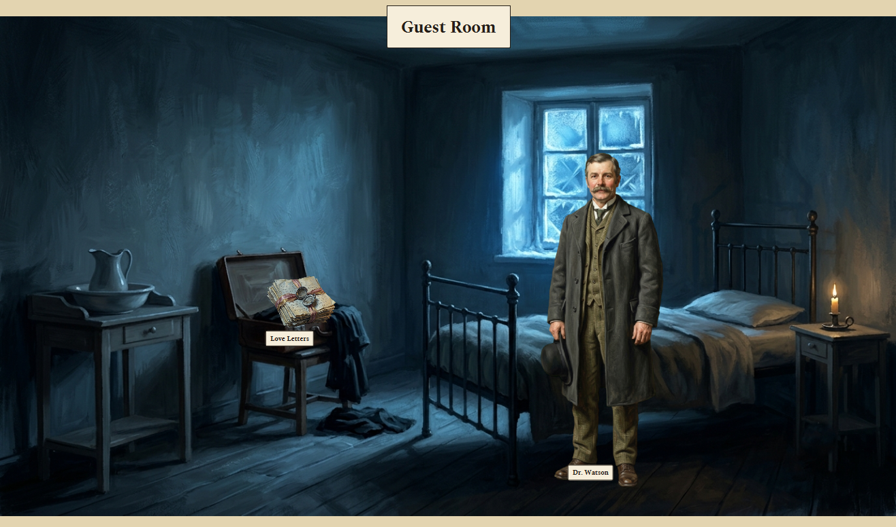
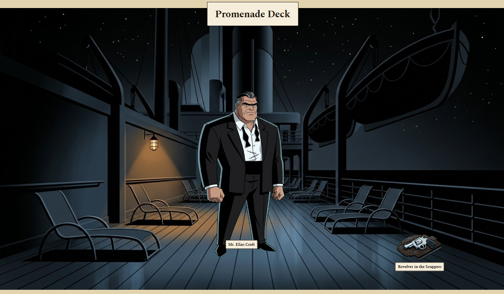
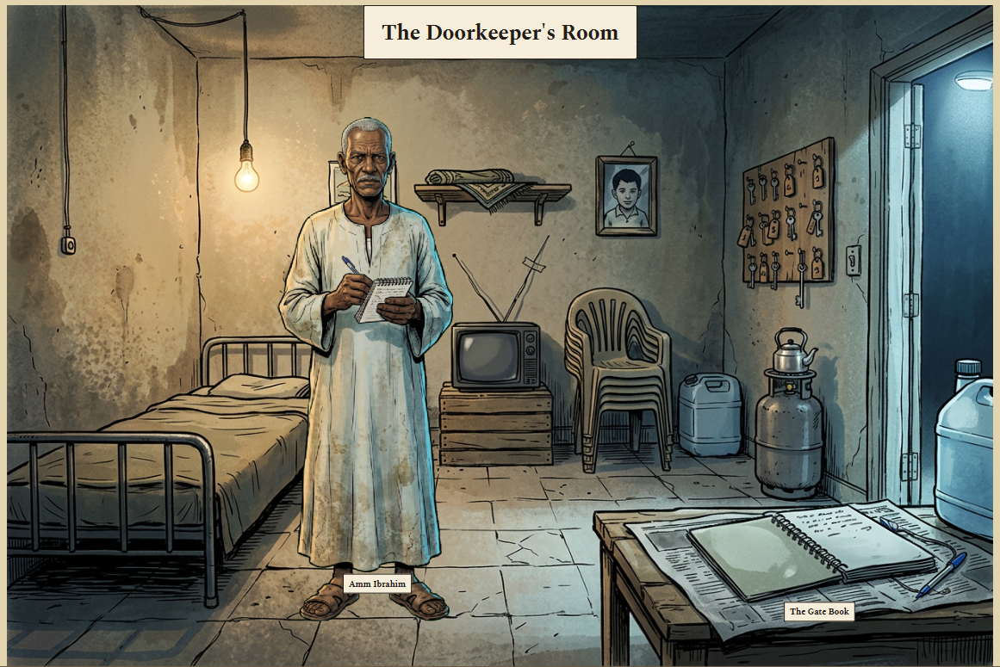

<div align="center">


# Sherlock's Legacy

**A detective game about catching people in their lies.**

[](LICENSE)
[](https://github.com/AmrGenidy/sherlocks-legacy/releases)

</div>

---

<div align="center">

</div>

---

A locked-room murder mystery in the spirit of Sherlock Holmes. You arrive at the scene of the crime, walk the rooms, examine what was left behind, and question everyone. They all have something to hide, and some of them will lie to your face. Find the evidence that breaks the lie, present it at the right moment, and watch their story fall apart.

Every case is fair: the solution is always reachable from the clues in front of you. No hidden information, no lucky guesses. When you think you have it, you name the culprit and find out how sharp you really were.

Play alone, fully offline. Or host a case on your local network and solve it together with a friend.

And when you run out of mysteries, write your own. The game ships with a full **Case Maker**, a built-in editor where you create the rooms, the suspects, their lies, and the evidence that breaks them. No coding needed. A finished case is a single folder you can hand to a friend.

## What's in the box

- **Interrogations with teeth.** Suspects hold a lie until you present the exact evidence that breaks it. Inspired by the courtroom drama of Ace Attorney.
- **Real deduction.** Combine clues into conclusions, and use those conclusions as new evidence. You build the solution piece by piece.
- **A detective's desk.** A journal for your findings, a pinboard where you connect clues with string, and Dr. Watson when you need a nudge.
- **Play together.** LAN multiplayer with a shared case, a shared pinboard, and a lobby that finds games on your network by itself.
- **Make your own murders.** The Case Maker turns the game into a story-writing tool. Four finished cases are included to play and learn from.
- **8 languages**, light and dark themes, and guided tutorials that teach by doing.

## Screenshots

<table>
  <tr>
    <td align="center" width="50%"><br/><sub><b>Main menu</b></sub></td>
    <td align="center" width="50%"><br/><sub><b>The pinboard</b></sub></td>
  </tr>
  <tr>
    <td align="center" width="50%"><br/><sub><b>On the scene</b></sub></td>
    <td align="center" width="50%"><br/><sub><b>The Case Maker</b></sub></td>
  </tr>
</table>

## The cases

Each case has its own setting, its own art, and its own way of lying to you:

<table>
  <tr>
    <td align="center" width="50%"><br/><sub><b>A Bitter Cup</b></sub></td>
    <td align="center" width="50%"><br/><sub><b>An Invitation to Judgement</b></sub></td>
  </tr>
  <tr>
    <td align="center" width="50%"><br/><sub><b>Crossing the Meridian</b></sub></td>
    <td align="center" width="50%"><br/><sub><b>The Building</b></sub></td>
  </tr>
</table>

## Play it

Grab the latest build from [**Releases**](https://github.com/AmrGenidy/sherlocks-legacy/releases). Unzip, open the folder, run **`Sherlock's Legacy.exe`**. That's it. No Java, no installer, no setup.

> Windows may warn you because the app isn't code-signed. Click **More info**, then **Run anyway**.

New cases go in the `cases` folder next to the game. Drop one in and it shows up in case selection.

## Build it yourself

You'll need JDK 17+ and [Maven](https://maven.apache.org/).

```bash
git clone https://github.com/AmrGenidy/sherlocks-legacy.git
cd sherlocks-legacy
mvn javafx:run
```

The full build and packaging guide lives in [docs/ARCHITECTURE.md](docs/ARCHITECTURE.md#building-and-packaging).

## Go deeper

| | |
|---|---|
| 📖 [**The Story**](HISTORY.md) | How four homework assignments became this game. |
| ✍️ [**Case Creation**](docs/CASE_CREATION.md) | Write your own mystery, from first clue to final exam. |
| 🎮 [**Gameplay**](docs/GAMEPLAY.md) | Every command and every window, explained. |
| 📐 [**Architecture**](docs/ARCHITECTURE.md) | How the engine, the multiplayer, and the case system work. |
| 🤝 [**Contributing**](CONTRIBUTING.md) | Fork it, fix it, or send in a case of your own. |

## License

Free and open source under the [GNU AGPL-3.0](LICENSE). Use it, change it, share it. Whatever you build from it must stay open under the same license and keep its credits, so the work always finds its way back home.

## Credits

Made by **Amr Mohamed**. Every line of code, every case, and every lie in it.

If you contribute, add yourself to [CONTRIBUTORS.md](CONTRIBUTORS.md). I'd love the company.
